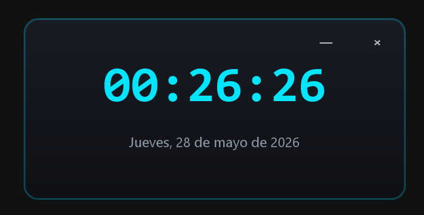

# 🕒 Reloj Digital Moderno 

Un reloj digital flotante, minimalista y con un diseño futurista estilo widget de escritorio, construido en Java 
utilizando las librerías nativas Swing y AWT.
Este proyecto transforma la clásica interfaz gris de Swing en una ventana estilizada, sin bordes de sistema, con 
esquinas redondeadas, fondo degradado y un sutil resplandor de neón.

<div align="center">
  
</div>

---

## ✨ Características

- **🎨 Diseño Moderno:** Ventana redondeada sin bordes tradicionales de sistema operativo (undecorated).
- **🌌 Apariencia Futurista:** Fondo degradado en tonos oscuros (space gray a azul profundo) con un borde brillante de color cian neón.
- **🕒 Sincronización en Tiempo Real:** Actualizaciones inmediatas y precisas de la hora (horas, minutos y segundos) y la fecha actual en tu idioma local.
- **⚡ Tipografía Anti-Vibración:** Uso de fuentes monoespaciadas para evitar que el tamaño de los números baile al cambiar los dígitos de la hora.
- **🖱️ Arrastre con el Ratón:** Al no poseer barra de título, cuenta con un sistema interactivo que permite arrastrar la ventana manteniendo presionado el clic izquierdo en cualquier parte del reloj.
- **❌ Controles Personalizados:** Botones flotantes elegantes para minimizar y cerrar la aplicación con efectos visuales al pasar el cursor (hover).

---

## 🛠️ Tecnologías Utilizadas

* **Lenguaje:** Java
* **Framework de UI:** Java Swing & AWT (Manejo de gráficos avanzados mediante `Graphics2D`).
* **Componentes Clave:** `Timer` para refresco por segundo, `GridBagLayout`/`BorderLayout`, y eventos de mouse personalizados (`MouseAdapter`, `MouseMotionAdapter`).

## 📦 Estructura del Proyecto

El corazón del proyecto se compone de los siguientes archivos:
* `RelojDigitalModerno.java`: Código fuente principal de la aplicación.
* `META-INF/MANIFEST.MF`: Archivo de manifiesto que define la clase principal para empaquetar el ejecutable.
* `Calculadora.jar` / `RelojDigitalModerno.jar`: Archivo ejecutable final compilado.

---

## 🚀 Cómo Ejecutar el Proyecto

### Opción 1: Ejecutar el archivo .JAR compilado
Si ya clonaste el repositorio y tenés el entorno de Java instalado, simplemente ejecutá el archivo empaquetado desde la terminal:
```bash
java -jar Calculadora.jar
```
### Opción 2: Compilar desde el código fuente
Si preferís compilar las clases manualmente desde la terminal:
### 1. Compilar el código fuente:
```bash
javac RelojDigitalModerno.java
```
### 2. Ejecutar la clase generada:
```bash
java RelojDigitalModerno
```
### 3. (Opcional) Crear tu propio archivo JAR:
```bash
jar cfm RelojDigitalModerno.jar manifest.txt RelojDigitalModerno*.class
```

---

## 👤 Autor

Maicol Daniel Mamani Chalco - https://github.com/Maicol843/

Si te gustó este proyecto, ¡no olvides darle una ⭐ en GitHub!

